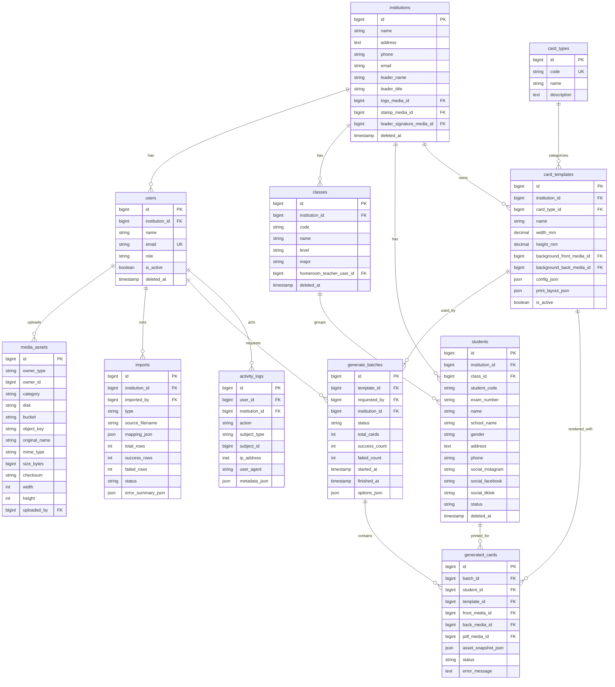

# ERD Aplikasi Kartu

Dokumen ini menurunkan [blueprint.md](/home/pgun/dev/card/blueprint.md) ke model relasional yang siap diimplementasikan di Laravel + PostgreSQL, dengan pertimbangan layout cetak A4 dari [a4_layout.html](/home/pgun/dev/card/a4_layout.html).

## Prinsip Desain
- Multi-instansi dengan user `admin` dan `guru`.
- Semua file media (foto, logo, stempel, tanda tangan, output generate) disimpan di MinIO dan direferensikan lewat `media_assets`.
- Template menyimpan konfigurasi elemen kartu dan konfigurasi cetak A4 2x5.
- Hasil generate menyimpan snapshot aset untuk menjaga histori tetap konsisten.

## ERD (Mermaid)


## Catatan Relasi Penting
- `students.student_code` harus unik per `institution_id`.
- `card_templates.institution_id` nullable untuk template global.
- `media_assets` menggunakan pasangan `owner_type + owner_id` untuk polymorphic ownership.
- `institutions.logo_media_id`, `stamp_media_id`, `leader_signature_media_id` menunjuk ke `media_assets.id`.
- `generated_cards.asset_snapshot_json` menyimpan object key aset branding saat render untuk histori immutable.

## Standar Layout Cetak A4 (Turunan dari a4_layout.html)
- Ukuran kartu ID-1: `85.6mm x 54mm`.
- Kertas: `A4 210mm x 297mm`.
- Grid default: `2 kolom x 5 baris` (10 kartu per halaman).
- Gap default: `5mm x 5mm`.
- Padding default halaman: `top 9.5mm`, `right 16.9mm`, `bottom 9.5mm`, `left 16.9mm`.

Nilai di atas disimpan dalam `card_templates.print_layout_json` agar bisa di-override per template tanpa ubah kode.

Contoh `print_layout_json`:
```json
{
  "page_size": "A4",
  "orientation": "portrait",
  "grid": { "columns": 2, "rows": 5 },
  "card_size_mm": { "width": 85.6, "height": 54 },
  "gap_mm": { "x": 5, "y": 5 },
  "padding_mm": { "top": 9.5, "right": 16.9, "bottom": 9.5, "left": 16.9 },
  "print_margin_mode": "none"
}
```

